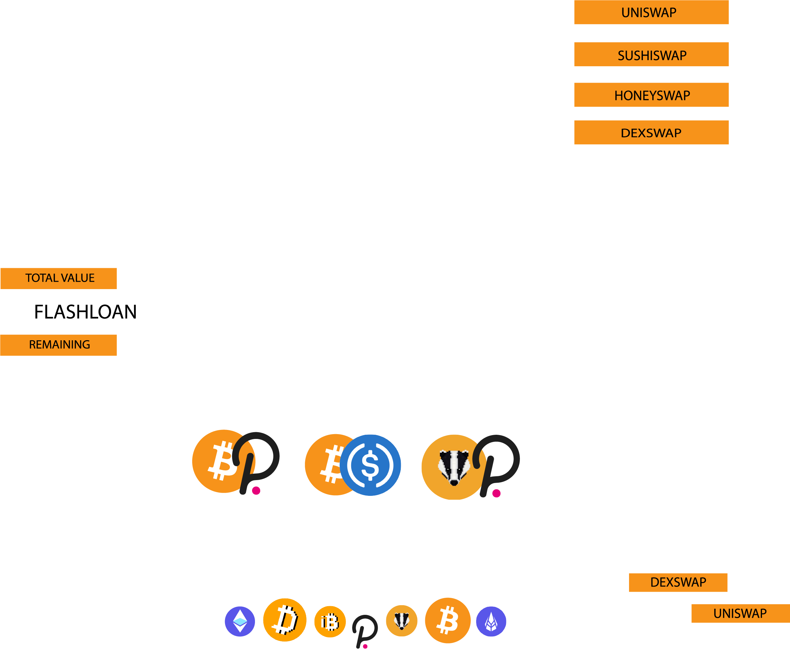
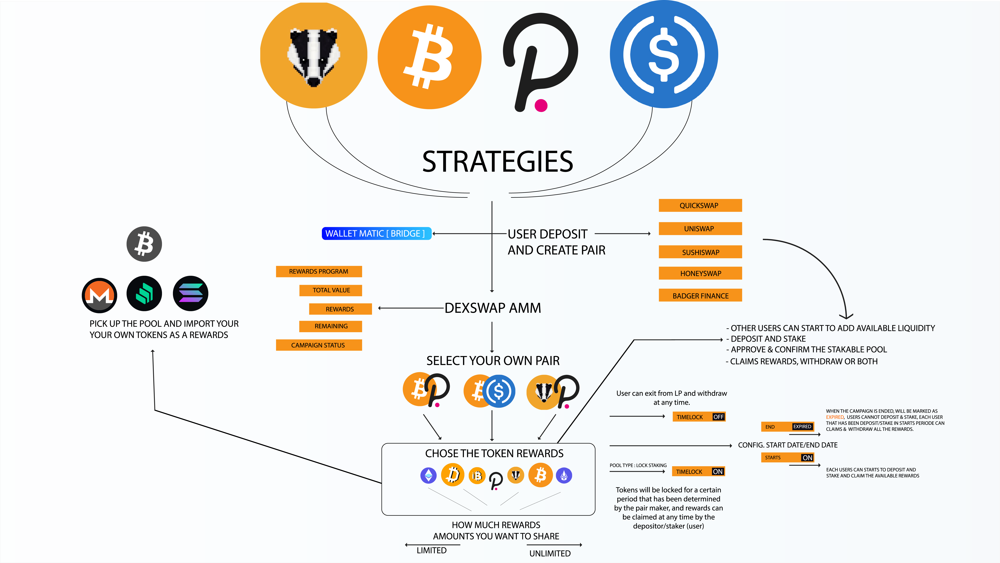

### UniSwap  ETH CC Hackathon 2021 : https://gitcoin.co/issue/unigrants/ugp-hacks/3/100026166

# DexSwap Finance ($DEXS)

Decentralized Protocol Optimizer for Multiple Exchanges

 
 

 
 

### What's make DexSwap different with other dex
- every users whos already deposit & stake on Liquidity minning campaign can claim their rewards in almost every day, everytime.
- the rewards came from the first staker whos create a liquidity minning and he will earn 0.25% from every user who participates in liquidity pool & liquidity minning.
- every users who wants to make/create Liquidity Minning Campaign is free to choose which coins he wants to share as a rewards for other users whos will join in the Liquidity Minning that has been created.

 
 

 
[DEXSWAP FRONTEND RINKEBY](https://dexswap-badger-rinkeby.netlify.app/)
> Works in:  RINKEBY 
> Liquidity Value in USD

[DEXSWAP FRONTEND MATIC MAINNET & MATIC TESTNET](https://dexswap-matic-badger.netlify.app/)
> Works in:  MATIC MAINNET
> Liquidity Value in USD

- [WorkFlow Video Explainer how to use DexSwap](https://www.youtube.com/watch?v=eO2ZzmYYn8o)   // RINKEBY
- [WorkFlow Video Explainer how to use DexSwap](https://www.youtube.com/watch?v=jK5r3pkONME)  // MATIC MAINNET

### Ethereum Mainnet is not implemented.

## Address MATIC MAINNET

DexSwap Factory:  
[0xeE9E5959bC2332EF6f29AcF40758a27ADa9ce6Cb](https://polygonscan.com/address/0xeE9E5959bC2332EF6f29AcF40758a27ADa9ce6Cb)

DexSwap FeeReceiver:  
[0x10f363fB57C80CDb7450aB4E8cE4961722e3A493](https://polygonscan.com/address/0x10f363fB57C80CDb7450aB4E8cE4961722e3A493)

DexSwap FeeSetter:  
[0xB08C36cB2382219f2ef0d1707Cca213A22bfeFf2](https://polygonscan.com/address/0xB08C36cB2382219f2ef0d1707Cca213A22bfeFf2)

DexSwap Router:  
[0x7e87a968141Ec02254B53B9e58f9D64355B11B18](https://polygonscan.com/address/0x7e87a968141Ec02254B53B9e58f9D64355B11B18)

DexSwap Multicall:  
[0x8EA37510A18233d6B081Fb54c36f76c0d58A8734](https://polygonscan.com/address/0x8EA37510A18233d6B081Fb54c36f76c0d58A8734)

DexSwap xDEXS Token:  
[0x8E8645D7A03d53bF41BcFfE26CfCCBA14354028C](https://polygonscan.com/address/0x8E8645D7A03d53bF41BcFfE26CfCCBA14354028C)

DexSwap LP:  
[0x3b9B9a88BeDCCb47E46D9dA8626932A065798272](https://polygonscan.com/address/0x3b9B9a88BeDCCb47E46D9dA8626932A065798272)

Staking Rewards Distribution:   
[0xC67ed58774dCE92A6994e911F418DAc3aa9fdfAd](https://polygonscan.com/address/0xC67ed58774dCE92A6994e911F418DAc3aa9fdfAd)

 
:: HASH(MATIC MAINNET) => 0x8d5cb477d33ed6bd41c4f92a58f79b1e620735c5408981f4f6aeb73fa189b571

:: [TOKEN LIST](https://github.com/Agin-DropDisco/crypto-logo-asset/blob/main/dexswap-token-list.json)

## Addresses  Rinkeby

DexSwap Factory:  
[0xD4E38C2e7B5a930D65e1E44A4eF5f72b4926a031](https://rinkeby.etherscan.io/address/0xD4E38C2e7B5a930D65e1E44A4eF5f72b4926a031)

DexSwap Deployer:  
[0x9A5e5F60F942b38dDFa8950BAfC62236eB25cba3](https://rinkeby.etherscan.io/address/0x9A5e5F60F942b38dDFa8950BAfC62236eB25cba3)

DexSwap FeeReceiver:  
[0x47b26244e887443ae88Dc5120b364a0bF5a474F0](https://rinkeby.etherscan.io/address/0x47b26244e887443ae88Dc5120b364a0bF5a474F0)

DexSwap FeeSetter:  
[0x439f9d1150659552D8C22645f61f4749a4335778](https://rinkeby.etherscan.io/address/0x439f9d1150659552D8C22645f61f4749a4335778)

DexSwap Router:  
[0xc872c6BCC2E4afb208DdfB93B13da70aD837C8fE](https://rinkeby.etherscan.io/address/0xc872c6BCC2E4afb208DdfB93B13da70aD837C8fE)

DexSwap Oracle:  
[0xce7539A046abB34160e9d0eFd2B1eC8CbF43C9Ca](https://rinkeby.etherscan.io/address/0xce7539A046abB34160e9d0eFd2B1eC8CbF43C9Ca)

DexSwap Emitter:  
[0x85f9276357e55c082584900183906FeE4374E978](https://rinkeby.etherscan.io/address/0x85f9276357e55c082584900183906FeE4374E978)

DexSwap Relayer:  
[0x1988CeC6Afd203e580Ebb151070544530228d496](https://rinkeby.etherscan.io/address/0x1988CeC6Afd203e580Ebb151070544530228d496)

DexSwap xDEXS Token Proxy:  
[0xa9c6d7f92a894310b9c04968326a9de6d0e38724](https://rinkeby.etherscan.io/address/0xa9c6d7f92a894310b9c04968326a9de6d0e38724)

DexSwap LP:  
[0x82c6063C71e0B6a249D74CB6B5A1a9803fDa9aF8](https://rinkeby.etherscan.io/address/0x82c6063C71e0B6a249D74CB6B5A1a9803fDa9aF8)

Staking Rewards Distribution:   
[0x1204f1d4DD016b23B4D6a021Ab9CEA845ac1D728](https://rinkeby.etherscan.io/address/0x1204f1d4DD016b23B4D6a021Ab9CEA845ac1D728)

## Token Mock Rinkeby v1

BADGER:   
[0x656D52d296609264cee25cb0C3A3D57151eA26F2](https://rinkeby.etherscan.io/address/0x656D52d296609264cee25cb0C3A3D57151eA26F2)

DIGG:   
[0x4d692461d6C8AebDF7D66b8dbFa38fef72720031](https://rinkeby.etherscan.io/address/0x4d692461d6C8AebDF7D66b8dbFa38fef72720031)

USDC:   
[0x0E028a9dAdBA642e8F97AD22160111A8C33717E4](https://rinkeby.etherscan.io/address/0x0E028a9dAdBA642e8F97AD22160111A8C33717E4)

USDT:   
[0x777aF1D5293Fa07dF6e3B125A2591fd73eD6a6c2](https://rinkeby.etherscan.io/address/0x777aF1D5293Fa07dF6e3B125A2591fd73eD6a6c2)

WBTC:   
[0xe436A52C158B1681ab76e224614ec8ab06D6D907](https://rinkeby.etherscan.io/address/0xe436A52C158B1681ab76e224614ec8ab06D6D907)

## Token Faucet Rinkeby (send zero value to get 1k TSM <> THM)

Teshimono   [TSM]:
[0x6e4e5814758648e52e26a86e5bc0277c06672d69](https://rinkeby.etherscan.io/address/0x6e4e5814758648e52e26a86e5bc0277c06672d69)

Tashiramina [THM]:
[0x6e4e5814758648e52e26a86e5bc0277c06672d69](https://rinkeby.etherscan.io/address/0x6e4e5814758648e52e26a86e5bc0277c06672d69)

## Address Mumbai
See:
- [Periphery](https://github.com/Agin-DropDisco/module-dexswap-periphery/blob/37a9f2903f661bf5add0b5fd7c3bd7e00f7a7498/.contracts.json#L13)

- [Core](https://github.com/Agin-DropDisco/module-dexswap-core/blob/2bebe9d4d6badc6a3091b0fad52d481cbeb104ba/.contracts.json#L29)

## Token Faucet MUMBAI (send zero value to get 1k TSM <> THM)

Teshimono    [TSM]:
[0x7139c2453f75685A4751399d0459da12bC2d2cb7](https://mumbai.polygonscan.com/address/0x7139c2453f75685A4751399d0459da12bC2d2cb7)

Tashiramina  [THM]:
[0x49e14c9E971956f6C4aF76ECB57fF800337E8b00](https://mumbai.polygonscan.com/address/0x49e14c9E971956f6C4aF76ECB57fF800337E8b00)
